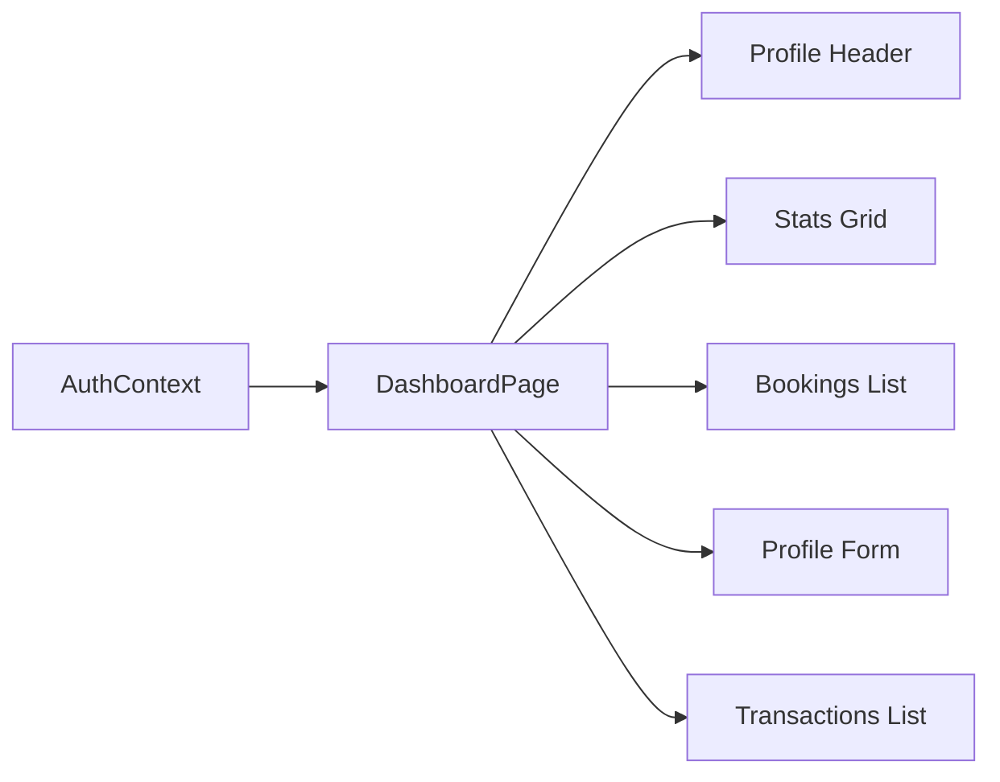

# Profile Page Documentation

## Overview
The Profile Page (Dashboard) is a comprehensive user interface that allows users to view and manage their personal information, track their bookings, manage transactions, and handle account verification. The page is implemented in `DashBoardPage.jsx` and provides a tabbed interface with three main sections: Overview, Profile Info, and Transactions.

## Table of Contents
1. [Page Structure](#page-structure)
2. [Data Flow Architecture](#data-flow-architecture)
3. [Tab Sections](#tab-sections)
4. [User Data Management](#user-data-management)
5. [API Endpoints](#api-endpoints)
6. [State Management](#state-management)
7. [Components and Features](#components-and-features)
8. [Verification System](#verification-system)

---

## Page Structure

### File Location
- **Frontend**: `frontend/src/pages/DashBoardPage.jsx`
- **Backend Routes**: `backend/routes/auth.js`
- **Context**: `frontend/src/context/AuthContext.jsx`
- **User Model**: `backend/models/User.js`

### Navigation Access
- **Route**: `/dashboard`
- **Access**: Protected route (requires authentication)
- **Tab Navigation**: Query parameter support (`?tab=overview|profile|transactions`)

---

## Data Flow Architecture

### 1. Initial Data Loading

```
Page Load
   ↓
AuthContext provides user data
   ↓
useEffect hooks trigger
   ↓
Fetch bookings, transactions, stats
   ↓
Update local state
   ↓
Render UI with data
```

### 2. User Data Source

The user data is managed through the **AuthContext** and contains:

```javascript
{
  id: String,                    // MongoDB _id
  googleId: String,              // Google OAuth ID
  email: String,                 // User's email
  name: String,                  // Full name
  picture: String,               // Profile picture URL (from Google)
  phone: String,                 // Phone number (optional)
  city: String,                  // City (optional)
  address: String,               // Address (optional)
  isProfileComplete: Boolean,    // Profile completion status
  isVerified: Boolean,           // Verification status
  verificationStatus: String,    // PENDING|APPROVED|REJECTED|NOT_SUBMITTED
  citizenshipPhoto: String,      // Citizenship document URL
  role: String,                  // user|admin
  hasListedVehicles: Boolean,    // Host status
  walletBalance: Number,         // Demo wallet balance
  createdAt: Date,               // Account creation date
  lastLogin: Date                // Last login timestamp
}
```

### 3. Data Display Flow



---

## Tab Sections

### 1. Overview Tab

**Purpose**: Provides a quick summary of user activity and statistics.

**Data Displayed**:
- **Wallet Balance**: `user.walletBalance` (default: NPR 100,000)
- **Total Bookings**: Count of all bookings
- **Active Rentals**: Bookings with status `CONFIRMED`
- **Total Spent**: Sum of prices from `CONFIRMED` and `COMPLETED` bookings

**Recent Bookings Section**:
- Shows last 5 bookings
- Each booking displays:
  - Vehicle image and name
  - Pickup and dropoff dates
  - Total price
  - Status badge (PENDING, CONFIRMED, CANCELLED, COMPLETED, etc.)

**Stats Calculation**:
```javascript
const stats = {
  totalBookings: userBookings.length,
  activeRentals: userBookings.filter(b => b.status === 'CONFIRMED').length,
  completedBookings: userBookings.filter(b => b.status === 'COMPLETED').length,
  totalSpent: userBookings
    .filter(b => b.status === 'CONFIRMED' || b.status === 'COMPLETED')
    .reduce((sum, b) => sum + (b.totalPrice || 0), 0)
};
```

### 2. Profile Info Tab

**Purpose**: Displays and allows editing of user profile information and manages account verification.

**Data Fields Displayed**:

| Field | Source | Editable | Display Logic |
|-------|--------|----------|---------------|
| **Profile Picture** | `user.picture` | No | Displayed in header (from Google OAuth) |
| **Full Name** | `user.name` | Yes | Editable field or read-only display |
| **Email** | `user.email` | No | Always read-only (Google OAuth) |
| **Phone Number** | `user.phone` | Yes | Editable field or "Not provided" |
| **City** | `user.city` | Yes | Editable field or "Not provided" |

**Profile Editing Flow**:
```
1. User clicks "Edit" button
   ↓
2. Form fields become editable
   ↓
3. User modifies name, phone, or city
   ↓
4. User clicks "Save"
   ↓
5. PATCH request to /api/auth/profile
   ↓
6. Backend updates User model
   ↓
7. Response updates AuthContext
   ↓
8. UI reflects new data
```

**Verification Status Display**:

The page shows different UI states based on `user.verificationStatus`:

| Status | Badge Color | Icon | Message | Upload Allowed |
|--------|------------|------|---------|----------------|
| **NOT_SUBMITTED** | Yellow | AlertCircle | "Verification Pending" | Yes |
| **PENDING** | Blue | Clock | "Under Review" | No |
| **APPROVED** | Green | FileCheck | "Verified ✓" | No |
| **REJECTED** | Red | FileX | "Verification Rejected" | Yes |

### 3. Transactions Tab

**Purpose**: Displays complete transaction history with filtering options.

**Data Structure**:
```javascript
{
  _id: String,
  userId: ObjectId,
  bookingId: ObjectId,
  amount: Number,
  type: 'DEBIT' | 'CREDIT',
  status: 'PENDING' | 'COMPLETED' | 'FAILED',
  description: String,
  vehicleName: String,
  createdAt: Date
}
```

**Features**:
- Filter by type: ALL, DEBIT, CREDIT
- Transaction icons:
  - DEBIT: Red upward arrow (ArrowUpRight)
  - CREDIT: Green downward arrow (ArrowDownLeft)
- Color coding: Red for debits, green for credits
- Balance calculation (credits - debits)

---

## User Data Management

### Data Loading Sequence

**1. Initial Page Load**:
```javascript
useEffect(() => {
  fetchBookings();      // Load user bookings
}, []);

useEffect(() => {
  if (activeTab === 'transactions') {
    fetchTransactions(); // Load transactions on tab switch
  }
}, [activeTab]);

useEffect(() => {
  if (user) {
    setProfileForm({    // Initialize profile form
      name: user.name || '',
      phone: user.phone || '',
      city: user.city || ''
    });
  }
}, [user]);
```

**2. Profile Header Data**:
The profile header always displays:
- Profile picture: `user.picture` (28x28 rounded image)
- Name: `user.name` (3xl bold heading)
- Email: `user.email` (with Mail icon)
- Phone: `user.phone` (with Phone icon, if provided)
- City: `user.city` (with MapPin icon, if provided)

**3. Data Persistence**:
- User data is stored in AuthContext state
- JWT token stored in localStorage
- All API calls include `Authorization: Bearer ${token}` header

---

## API Endpoints

### 1. Get User Profile
```
GET /api/auth/me
Headers: { Authorization: Bearer <token> }

Response:
{
  user: {
    id, googleId, email, name, picture,
    phone, city, address,
    isVerified, verificationStatus, citizenshipPhoto,
    role, hasListedVehicles, isProfileComplete,
    walletBalance, createdAt, lastLogin
  }
}
```

### 2. Update Profile
```
PATCH /api/auth/profile
Headers: { Authorization: Bearer <token> }
Body: {
  name: String (optional),
  phone: String (optional),
  city: String (optional)
}

Response:
{
  message: "Profile updated successfully",
  user: { ...updated user data }
}
```

### 3. Upload Citizenship Document
```
POST /api/auth/upload-citizenship
Headers: { Authorization: Bearer <token> }
Body: {
  citizenshipUrl: String (Cloudinary URL)
}

Response:
{
  message: "Citizenship uploaded successfully",
  user: { ...updated user data with verificationStatus: 'PENDING' }
}
```

### 4. Get User Bookings
```
GET /api/bookings/user
Headers: { Authorization: Bearer <token> }

Response:
{
  bookings: [
    {
      _id, userId, vehicle: {...}, vehicleId,
      pickupDate, dropoffDate, pickupLocation,
      totalPrice, status, createdAt
    }
  ]
}
```

### 5. Get Transaction History
```
GET /api/payment/user/history
Headers: { Authorization: Bearer <token> }

Response:
{
  payments: [
    {
      _id, userId, bookingId, amount, type,
      status, description, vehicleName, createdAt
    }
  ]
}
```

---

## State Management

### Local Component State

```javascript
// Tab navigation
const [activeTab, setActiveTab] = useState('overview');

// Bookings and stats
const [bookings, setBookings] = useState([]);
const [stats, setStats] = useState({
  totalBookings: 0,
  activeRentals: 0,
  totalSpent: 0,
  completedBookings: 0
});
const [loading, setLoading] = useState(true);

// Transactions
const [transactions, setTransactions] = useState([]);
const [transactionsLoading, setTransactionsLoading] = useState(false);
const [filter, setFilter] = useState('ALL');

// Profile editing
const [isEditingProfile, setIsEditingProfile] = useState(false);
const [profileForm, setProfileForm] = useState({ 
  name: '', 
  phone: '', 
  city: '' 
});
const [profileError, setProfileError] = useState('');
const [savingProfile, setSavingProfile] = useState(false);

// Citizenship verification
const [citizenshipFile, setCitizenshipFile] = useState(null);
const [uploadingCitizenship, setUploadingCitizenship] = useState(false);
const [citizenshipError, setCitizenshipError] = useState('');
const [citizenshipSuccess, setCitizenshipSuccess] = useState('');
```

### Context State (AuthContext)

```javascript
const { user, updateUser, refreshUser } = useAuth();

// updateUser: Merges new data into existing user state
updateUser({ name: 'New Name', phone: '+977-9800000000' });

// refreshUser: Fetches latest user data from server
await refreshUser();
```

---

## Components and Features

### 1. Profile Header Card
- **Background**: Blue to indigo gradient
- **Layout**: Flex container with profile picture and user info
- **Data Shown**:
  - Profile picture (28x28, rounded, bordered)
  - Name (3xl, bold)
  - Email, Phone (if available), City (if available)

### 2. Stats Grid
- 4 cards in responsive grid (1 col on mobile, 4 cols on desktop)
- Each stat card shows:
  - Icon (colored background)
  - Label
  - Value (large, bold)
- First card (Wallet) is clickable → navigates to transactions tab

### 3. Bookings Section
- Shows recent 5 bookings
- Each booking card displays:
  - Vehicle image (16x16)
  - Vehicle name
  - Date range
  - Total price
  - Status badge (color-coded)
- "View All Bookings" button redirects to `/bookings`

### 4. Profile Edit Form
- Toggle between view and edit modes
- Edit/Save/Cancel buttons
- Input validation:
  - Name: Required
  - Phone: Optional, freeform text
  - City: Optional, freeform text
- Error display for failed updates

### 5. Verification Section
- File input for citizenship document
- Constraints:
  - File types: JPG, PNG only
  - Max size: 5MB
  - Uploads to Cloudinary first, then URL saved to backend
- Status badges show verification state
- Upload button disabled when uploading or no file selected

### 6. Transactions List
- Filter buttons: ALL, DEBIT, CREDIT
- Each transaction shows:
  - Type icon (arrow up/down)
  - Description and vehicle name
  - Amount (color-coded: red for debit, green for credit)
  - Date and time
  - Status
- Balance summary at top (credits, debits, net)

---

## Verification System

### Citizenship Upload Process

**Frontend Flow**:
```javascript
1. User selects file
   ↓ (validate size < 5MB, type is JPG/PNG)
2. File stored in state
   ↓
3. User clicks "Upload"
   ↓
4. Upload to Cloudinary
   ↓ (POST to Cloudinary API)
5. Get secure_url from response
   ↓
6. Send URL to backend
   ↓ (POST /api/auth/upload-citizenship)
7. Backend saves URL and sets verificationStatus = 'PENDING'
   ↓
8. Update user context
   ↓
9. Show success message
```

**Backend Processing** (`backend/routes/auth.js`):
```javascript
POST /api/auth/upload-citizenship
- Receives: { citizenshipUrl: String }
- Updates User:
  - citizenshipPhoto = url
  - verificationStatus = 'PENDING'
  - isVerified = false
- Returns: Updated user object
```

**Admin Verification** (separate admin page):
```javascript
POST /api/auth/verify-user/:userId
- Admin only route
- Action: 'APPROVE' or 'REJECT'
- If APPROVE:
  - isVerified = true
  - verificationStatus = 'APPROVED'
- If REJECT:
  - isVerified = false
  - verificationStatus = 'REJECTED'
```

### Status Meanings

| Status | User Can Upload | User Can Book | Displayed To User |
|--------|----------------|---------------|-------------------|
| **NOT_SUBMITTED** | Yes | Limited | "Please upload citizenship" |
| **PENDING** | No | Limited | "Document under review" |
| **APPROVED** | No | Yes | "Verified ✓" |
| **REJECTED** | Yes | Limited | "Rejected - Upload again" |

---

## Key Features Summary

### Data Visibility
- ✅ Real-time user profile data from AuthContext
- ✅ Booking history with vehicle details
- ✅ Transaction history with filtering
- ✅ Wallet balance display
- ✅ Verification status tracking

### User Interactions
- ✅ Edit name, phone, and city
- ✅ Upload citizenship document
- ✅ Navigate between tabs
- ✅ Filter transactions by type
- ✅ View booking details
- ✅ Click wallet to view transactions

### Data Updates
- ✅ Profile updates immediately reflected in UI
- ✅ Context state synchronized with backend
- ✅ Automatic data refresh on tab switches
- ✅ Error handling with user-friendly messages
- ✅ Loading states for async operations

---

## Technical Implementation Details

### Cloudinary Integration

```javascript
const CLOUD_NAME = process.env.REACT_APP_CLOUDINARY_CLOUD_NAME;
const UPLOAD_PRESET = process.env.REACT_APP_CLOUDINARY_UPLOAD_PRESET;

const formData = new FormData();
formData.append('file', citizenshipFile);
formData.append('upload_preset', UPLOAD_PRESET);
formData.append('folder', 'citizenship_documents');

const response = await fetch(
  `https://api.cloudinary.com/v1_1/${CLOUD_NAME}/image/upload`,
  { method: 'POST', body: formData }
);
```

### Query Parameter Sync

```javascript
// Read tab from URL
useEffect(() => {
  const params = new URLSearchParams(location.search);
  const tabParam = params.get('tab');
  if (tabParam && ['overview', 'profile', 'transactions'].includes(tabParam)) {
    setActiveTab(tabParam);
  }
}, [location.search]);
```

### Protected Route Pattern

The page assumes authentication is already handled by a route guard:
```javascript
// In App.jsx
<Route 
  path="/dashboard" 
  element={
    <ProtectedRoute>
      <DashboardPage />
    </ProtectedRoute>
  } 
/>
```

---

## User Experience Flow

### First-Time User Journey
1. User logs in with Google OAuth
2. Redirected to profile completion (`/register-details`)
3. After completion, lands on dashboard
4. Sees empty bookings and transactions
5. Prompted to verify account (citizenship upload)

### Returning User Journey
1. User logs in
2. Lands on dashboard (overview tab)
3. Sees stats, recent bookings
4. Can navigate to profile or transactions tabs
5. Can edit profile information
6. Can check verification status

---

## Error Handling

### Profile Update Errors
```javascript
try {
  await axios.patch('/api/auth/profile', payload);
  updateUser(newData);
} catch (err) {
  setProfileError(err.response?.data?.message || 'Failed to update profile');
}
```

### Citizenship Upload Errors
- File size validation (client-side)
- File type validation (client-side)
- Cloudinary upload errors (network/API)
- Backend save errors (server)
- All errors displayed with red error banners

### Data Fetch Errors
- Silent fail with empty state
- Console logs for debugging
- Loading spinners indicate async operations

---

## Performance Considerations

### Lazy Loading
- Transactions only fetched when tab is active
- Bookings fetched once on mount
- User data cached in AuthContext

### Optimizations
- Stats calculated from existing booking data (no extra API call)
- Profile form initialized only when user data available
- File upload shows progress/disabled state during processing

---

## Future Enhancements

### Potential Improvements
1. **Address Field**: Add address editing in profile
2. **Profile Picture Update**: Allow users to change profile picture
3. **Transaction Export**: Download transactions as CSV/PDF
4. **Advanced Filters**: Date range filtering for bookings
5. **Pagination**: For large booking and transaction lists
6. **Real-time Updates**: WebSocket for instant transaction updates
7. **Document Preview**: Show uploaded citizenship before submission
8. **Multi-Document Support**: Upload multiple verification documents

---

## Conclusion

The Profile Page serves as the central hub for user account management in RideShareX. It provides comprehensive visibility into user data, bookings, transactions, and verification status. The implementation follows React best practices with clear separation of concerns, proper state management, and intuitive UX patterns.

**Key Strengths**:
- Clean, tabbed interface for organized information
- Real-time data synchronization with backend
- Secure citizenship verification workflow
- Responsive design for all screen sizes
- Clear visual feedback for all user actions

**Data Flow Summary**: User data flows from MongoDB → Backend API → AuthContext → Dashboard Component → UI, with bidirectional updates for profile edits and verification uploads.
