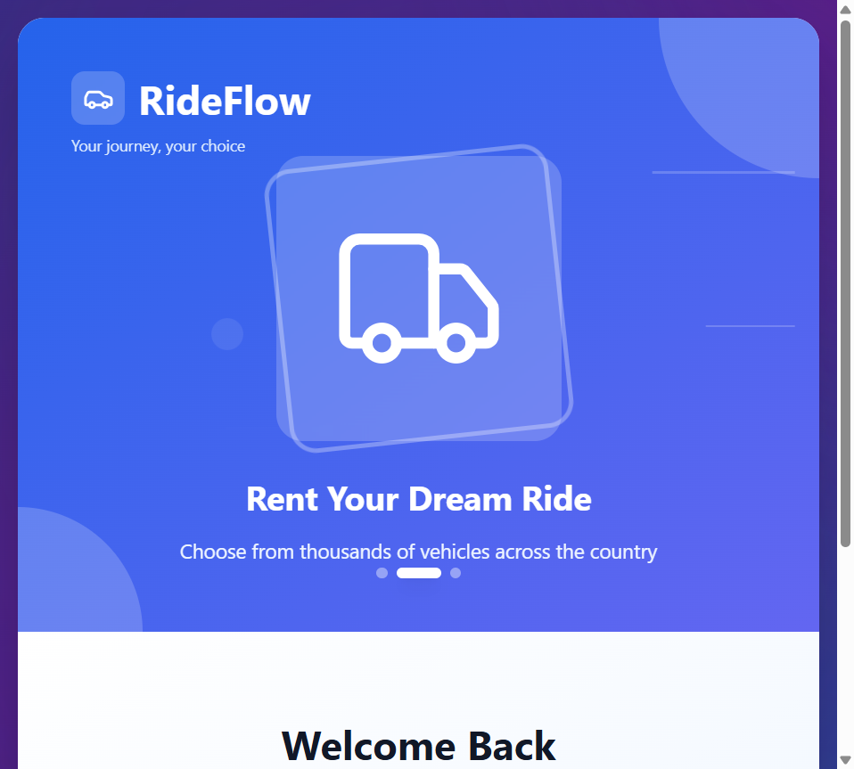
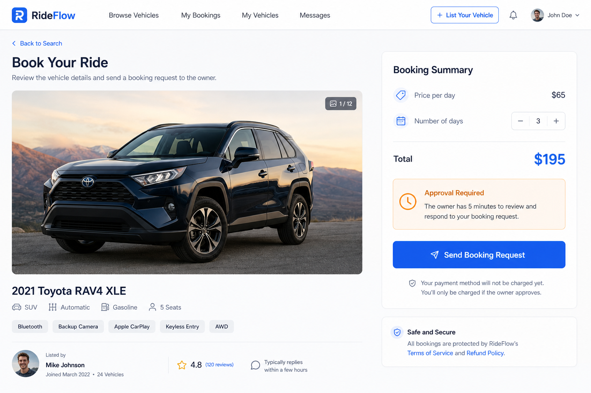
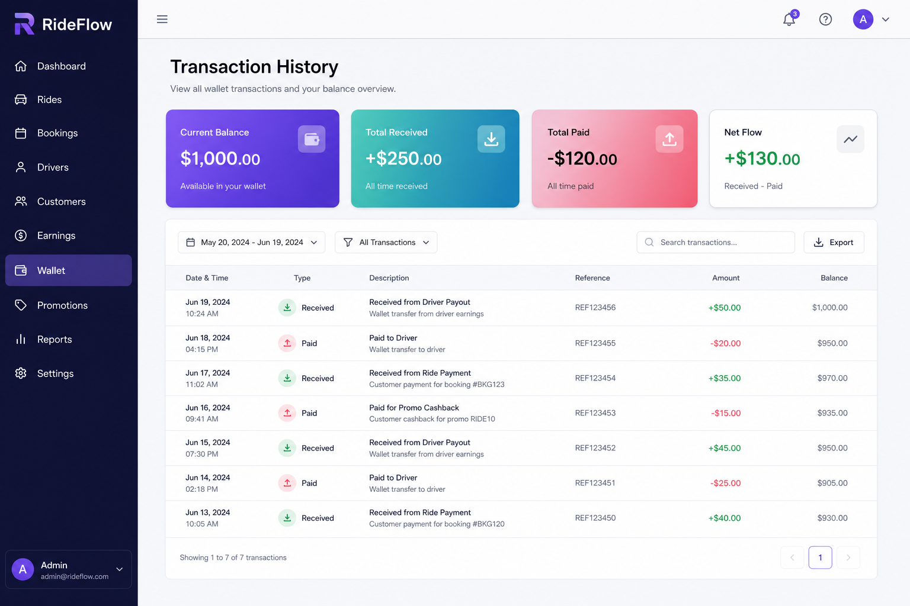

# RideFlow — Real-Time Vehicle Sharing Platform

RideFlow is a production-style peer-to-peer mobility platform that enables users to list, discover, and book vehicles in real time.

The platform is engineered using modern full-stack technologies and cloud-native deployment patterns, featuring secure JWT authentication, Google OAuth, live booking workflows, scalable media uploads, role-based user management, and AWS-based production deployment architecture.

Built to simulate real-world distributed systems challenges such as booking concurrency, async workflows, authentication security, cloud storage, and scalable API communication.

---

## 🚀 Production Features

- JWT-based authentication and protected API routes  
- Google OAuth integration  
- Real-time booking lifecycle management  
- Booking overlap prevention and concurrency handling  
- Cloud-based image upload pipeline using Cloudinary  
- AWS deployment architecture (S3 + CloudFront + Elastic Beanstalk)  
- Role-based access control  
- RESTful API architecture  
- Responsive React frontend  
- Secure environment-based configuration  
- Scalable MERN stack architecture  
- Transaction and **simulated wallet infrastructure** (demo ledger, not production payments)  

---

## 🏗️ System Architecture

```txt
                    ┌──────────────────────┐
                    │    React Frontend    │
                    │  Rider / Owner UI    │
                    └─────────┬────────────┘
                              │
                              │ HTTPS / REST APIs
                              ▼
                    ┌──────────────────────┐
                    │    Node.js Backend   │
                    │   Express REST API   │
                    └───────┬───────┬─────┘
                            │       │
                            │       │
              ┌─────────────▼──┐    │
              │    MongoDB      │    │
              │ Users/Bookings  │    │
              └────────────────┘    │
                                    │
                    ┌───────────────▼────────────┐
                    │ Cloudinary Media Storage   │
                    │ Vehicle/Profile Uploads    │
                    └────────────────────────────┘

        AWS Deployment Layer
─────────────────────────────────────────────
Frontend → S3 + CloudFront
Backend  → Elastic Beanstalk / ECS
Secrets  → AWS Secrets Manager
DNS      → Route53
```

---

## ⚡ Engineering Challenges Solved

### Booking concurrency

Implemented booking overlap validation so conflicting pickup/drop-off windows cannot be confirmed for the same vehicle, reducing double-booking risk in a request-based workflow.

### Authentication security

Integrated JWT for authenticated API access together with Google OAuth on the client; sensitive routes use middleware-backed authorization.

### Scalable media uploads

Delegated vehicle and profile images to Cloudinary instead of storing binary assets on the application server, keeping the API stateless and upload throughput scalable.

### Cloud deployment

Documented and aligned the codebase with an AWS-shaped deployment path: static frontend on S3 behind CloudFront, Node API on Elastic Beanstalk (or ECS), secrets externalized, DNS via Route 53.

### Role-based workflows

Separate flows for renters, vehicle owners (listing and rental requests), and admin-side verification review for optional identity checks.

---

## 🛠️ Tech Stack

### Frontend

- React  
- JavaScript  
- Tailwind CSS  
- Axios  
- React Router  

### Backend

- Node.js  
- Express.js  
- JWT authentication  
- Google OAuth (token exchange via backend)  
- REST APIs  
- Mongoose  

### Database

- MongoDB (Atlas recommended for production)

### Cloud and DevOps

- AWS S3  
- AWS CloudFront  
- AWS Elastic Beanstalk  
- Route 53  
- Docker (planned)  
- GitHub Actions (planned)  

### Media and integrations

- Cloudinary  
- Google OAuth APIs  

---

## Prerequisites

- [Node.js](https://nodejs.org/) (LTS)  
- MongoDB ([Atlas](https://www.mongodb.com/cloud/atlas) or local URI)  
- [Google Cloud](https://console.cloud.google.com/) OAuth Web Client ID  
- [Cloudinary](https://cloudinary.com/) cloud name and unsigned upload preset  

---

## Quick start

From the repository root:

```bash
npm run install:all
```

**Backend** — `backend/.env`:

```env
MONGODB_URI=mongodb://localhost:27017/rideflow
JWT_SECRET=your_long_random_secret
PORT=5000
GOOGLE_CLIENT_ID=your_id.apps.googleusercontent.com
FRONTEND_URL=http://localhost:3000
```

**Frontend** — `frontend/.env`:

```env
REACT_APP_API_URL=http://localhost:5000
REACT_APP_GOOGLE_CLIENT_ID=your_id.apps.googleusercontent.com
REACT_APP_CLOUDINARY_CLOUD_NAME=your_cloud_name
REACT_APP_CLOUDINARY_UPLOAD_PRESET=your_unsigned_preset
```

Run:

```bash
npm run dev
```

| URL | Role |
|-----|------|
| http://localhost:3000 | React UI |
| http://localhost:5000 | Express API |

---

## Root npm scripts

| Command | Description |
|---------|-------------|
| `npm run dev` | Backend + frontend development servers |
| `npm run dev:backend` | Backend only |
| `npm run start:frontend` | Frontend only |
| `npm run install:all` | Install dependencies at root, backend, and frontend |

---

## 📡 API Overview

Representative REST surface (all prefixed by your deployed API origin, e.g. `https://api.example.com`).

### Authentication

| Method | Path | Notes |
|--------|------|--------|
| `POST` | `/api/auth/google-login` | Google OAuth sign-in / signup |
| `POST` | `/api/auth/complete-profile` | Finish profile after OAuth (protected) |
| `GET` | `/api/auth/me` | Current user (protected) |
| `PATCH` | `/api/auth/profile` | Update profile (protected) |
| `POST` | `/api/auth/upload-profile-picture` | Profile image (protected) |
| `POST` | `/api/auth/upload-citizenship` | Optional ID upload (protected) |
| `GET` | `/api/auth/pending-verifications` | Admin: pending reviews (protected) |
| `POST` | `/api/auth/verify-user/:userId` | Admin: approve/reject (protected) |

### Vehicles

| Method | Path | Notes |
|--------|------|--------|
| `GET` | `/api/vehicles` | Public marketplace list |
| `POST` | `/api/vehicles/add` | Create listing (protected) |
| `GET` | `/api/vehicles/my-vehicles` | Owner inventory (protected) |
| `PATCH` | `/api/vehicles/:vehicleId/status` | Active / inactive (protected) |
| `DELETE` | `/api/vehicles/:vehicleId` | Delete listing (protected) |

### Bookings

| Method | Path | Notes |
|--------|------|--------|
| `POST` | `/api/bookings` | Create booking request (protected) |
| `GET` | `/api/bookings/user` | Renter bookings (protected) |
| `GET` | `/api/bookings/owner` | Owner rental requests (protected) |
| `GET` | `/api/bookings/:bookingId` | Booking detail (protected) |
| `PATCH` | `/api/bookings/:bookingId/status` | Owner confirm/reject (protected) |
| `PATCH` | `/api/bookings/:bookingId/cancel` | Cancel flow (protected) |

### Payments and simulated wallet

| Method | Path | Notes |
|--------|------|--------|
| `POST` | `/api/payment/demo` | Process simulated wallet payment (protected) |
| `GET` | `/api/payment/booking/:bookingId` | Payment by booking (protected) |
| `GET` | `/api/payment/user/history` | Transaction history (protected) |
| `POST` | `/api/payment/refund/:paymentId` | Refund marker for demos (protected) |
| `DELETE` | `/api/payment/user/clear-history` | Clear visible history (protected) |

### Recommendations

| Method | Path | Notes |
|--------|------|--------|
| `GET` | `/api/recommendations/:userId` | Personalized vehicle suggestions |

### Health

| Method | Path | Notes |
|--------|------|--------|
| `GET` | `/api/health` | Liveness check |

---

## ☁️ Cloud Deployment Architecture

RideFlow maps cleanly onto AWS: **MongoDB Atlas** for data (recommended), **S3 + CloudFront** for the React production build, and **Elastic Beanstalk** or **ECS Fargate** for the Express API. Use **Route 53** for DNS and **Secrets Manager** or **SSM Parameter Store** for `JWT_SECRET`, `MONGODB_URI`, and OAuth configuration.

**Typical steps**

1. Provision Atlas; allow outbound from your compute tier; inject `MONGODB_URI` via secrets.  
2. Deploy the backend with environment variables (`PORT`, `JWT_SECRET`, `GOOGLE_CLIENT_ID`, `FRONTEND_URL` pointing at your CloudFront URL).  
3. Build the frontend with `REACT_APP_API_URL` set to the API URL; upload `frontend/build` to S3; front it with CloudFront (SPA fallback to `index.html`).  
4. Register OAuth origins for CloudFront and API URLs in Google Cloud Console.  
5. Replace simulated wallet infrastructure with a regulated payment provider before accepting real funds.

---

## 📈 Scalability Improvements

Planned production-scale enhancements:

- Redis caching for hot reads and session-adjacent data  
- WebSocket-based real-time notifications  
- Queue-backed async jobs (e.g. BullMQ)  
- Dockerized services and repeatable environments  
- Kubernetes orchestration for multi-service scale-out  
- CI/CD with GitHub Actions  
- Distributed booking and payment event processing  
- Payment gateway integration (e.g. Stripe)  
- Observability with Prometheus / Grafana  

---

## 📸 Screenshots

**Landing** is captured from the running app (Google sign-in entry). **Vehicles, booking, and wallet** images are high-fidelity UI previews aligned with the shipped screens; those routes are behind authentication, so they were rendered for documentation consistency—swap in your own captures anytime from `/vehicles`, `/book-now`, and `/transactions` (or dashboard wallet tab) after signing in.

### Landing Page



### Vehicle browsing


### Booking flow



### Simulated wallet / transactions



---

## Repository layout

```
rideflow/
├── backend/       Express API, Mongoose models, middleware
├── frontend/      React SPA
└── Documentation/ Extended references (optional)
```

Deep dives: [`Documentation/`](Documentation/).

---

## License

Coursework / portfolio demonstration — adapt the license for your distribution needs.

**Remote:** [github.com/samarth1412/RideFlow](https://github.com/samarth1412/RideFlow)
